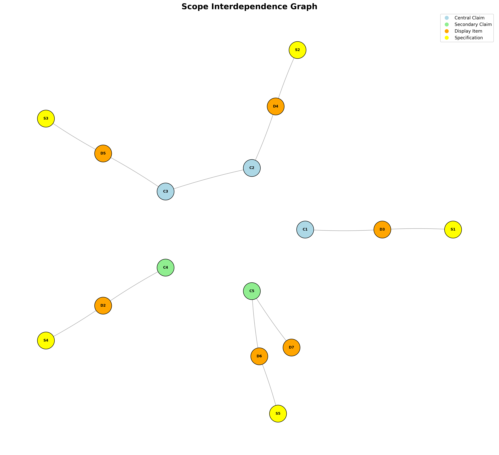

# Background

## Introduction to the Paper
This paper investigates the relationship between large-scale energy injection, coherent structures, and particle transport in three-dimensional (3D) solenoidal turbulence. Using high-resolution direct numerical simulations (DNS) of subsonic, isothermal flow, the authors analyze the trajectories of passive Lagrangian tracers to characterize the temporal evolution of transport across ballistic, superdiffusive, and diffusive regimes.

The primary objective is to demonstrate how the rotational nature of solenoidal forcing imposes a specific directional preference on particle dispersion. Specifically, the paper aims to show that dispersion perpendicular to the large-scale velocity field systematically exceeds parallel dispersion. Additionally, the study evaluates the hypothesis that vortex trapping causes anomalous transport (such as Lévy flights), concluding that trapping events are too brief—lasting approximately 7% of a large-eddy turnover time—to generate long-term memory, ultimately ensuring a return to classical, albeit anisotropic, diffusion.

## Scope of Reproducibility
The scope of this reproduction is limited to the claims tested by the identified must-run experiments. These experiments focus on the core transport dynamics and the kinematic signatures of solenoidal forcing.

*   **Claim C4: Temporal evolution of transport regimes.** This claim states that Mean-Square Displacement (MSD) transitions through ballistic ($\alpha \approx 2$), superdiffusive, and diffusive ($\alpha \approx 1$) regimes before reaching geometric saturation. It is tested by **EXP1**, which is expected to produce a scaling exponent $\alpha$ that descends from approximately 2 to 1 over physical time.
*   **Claim C1: Transverse-dominant anisotropic dispersion.** This claim asserts that dispersion perpendicular to the local large-scale velocity field exceeds parallel dispersion. It is tested by **EXP2**, where the dynamic anisotropy ratio $\lambda(t)$ is expected to drop and stabilize below unity, targeting a value of $0.52 \pm 0.045$.
*   **Claim C2: Transient vortex residence times.** This claim posits that vortex trapping events are brief and do not generate long-term memory. It is tested by **EXP3**, which measures the $1/e$ decay of the Q-criterion autocorrelation along tracer trajectories. The expected evidence is a characteristic trapping timescale $\tau_Q$ of approximately $0.200$.

To see the full claims and their relationships, see Figure 1 below.

*Figure 1. Scope graph showing the full tested claims and their relationships. To interpret the scope graph, refer to the scope graph key in the Appendix.*

## Methodology

### Datasets

#### Solenoidal Turbulence DNS Velocity Snapshots (DS1)
*   **Role in Reproduction:** This dataset provides the base velocity fields used for Lagrangian tracer integration and the derivation of auxiliary fields (vorticity, Q-criterion, and filtered large-scale velocity).
*   **Availability:** Partially available. The reproduction uses 100 VTK snapshots (indices 18903 to 19893 with a step of 10).
*   **Split/Setup Notes:** The data represents a continuous temporal sequence on a periodic $L=1$ cubic grid. The physical time step size ($dt$) between indices must be inferred to match the paper's large-eddy turnover time ($T_e \approx 2.6$).
*   **Preprocessing:** Requires computing the velocity gradient tensor for the Q-criterion and applying a sharp spectral Fourier filter (retaining wavenumbers $n=1-3$) to isolate the large-scale velocity field ($V_{LS}$).
*   **Reduction Note:** The reproduction uses a narrower temporal scope than the original paper, which utilized 200 snapshots. This reduction may affect the statistical convergence of late-time diffusive statistics and saturation artifacts.

### Must-Run Experiments

#### EXP1: Lagrangian Tracer Integration and MSD Regimes
*   **Claims Tested:** C4
*   **Intended Procedure:** 8,000 tracers are seeded at random uniform positions within the $L=1$ domain. Their trajectories are solved using a fourth-order Runge-Kutta (RK4) scheme with 10 integration sub-steps between snapshots. Trilinear interpolation is used to determine velocity at off-grid positions, and periodic boundary conditions are enforced via modulo operations.
*   **Required Outputs:** A CSV table containing ensemble-averaged MSD and the local scaling exponent $\alpha(t)$ versus lag time.
*   **Expected Result:** The scaling exponent $\alpha$ should transition from a ballistic regime ($\alpha \approx 2$) through a superdiffusive crossover to a diffusive regime ($\alpha \approx 1$).

#### EXP2: Anisotropy of Filtered Dispersion
*   **Claims Tested:** C1
*   **Intended Procedure:** A 3D Fast Fourier Transform (FFT) is applied to each velocity snapshot. A sharp spectral filter is used to retain only the driving modes ($n=1-3$), followed by an inverse FFT to obtain $V_{LS}$. Tracer displacements are then decomposed into components parallel and perpendicular to the local unit vector of $V_{LS}$ at each time step.
*   **Required Outputs:** A CSV table tracking parallel MSD, perpendicular MSD, and the resulting anisotropy ratio $\lambda(t) = MSD_{\parallel} / MSD_{\perp}$.
*   **Expected Result:** After an initial ballistic phase where $\lambda > 1$, the ratio should drop and stabilize at $\lambda \approx 0.52 \pm 0.1$, confirming that transverse dispersion dominates.

#### EXP3: Vortex Residence and Q-Autocorrelation
*   **Claims Tested:** C2
*   **Intended Procedure:** The Q-criterion field is calculated for every snapshot using the vorticity and strain-rate tensors. This scalar field is interpolated along the tracer trajectories generated in EXP1. The Lagrangian autocorrelation of the Q-criterion signal is then computed for the ensemble.
*   **Required Outputs:** A CSV table of the normalized autocorrelation function and a report of the calculated trapping timescale $\tau_Q$ (the $1/e$ decay time).
*   **Expected Result:** The autocorrelation should decay rapidly, yielding a timescale $\tau_Q \approx 0.200$, which corresponds to a small fraction ($\approx 7\%$) of the large-eddy turnover time.