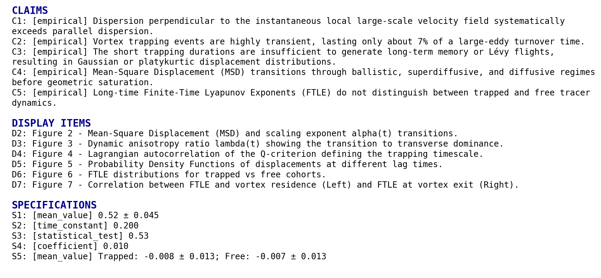

# Background

## Introduction to the Paper
This paper investigates the relationship between large-scale energy injection, coherent structures, and particle transport in three-dimensional (3D) solenoidal turbulence. Using high-resolution direct numerical simulations (DNS) of subsonic, isothermal flow, the authors analyze the trajectories of passive Lagrangian tracers to characterize the temporal evolution of transport across ballistic, superdiffusive, and diffusive regimes.

The primary objective is to demonstrate how the rotational nature of solenoidal forcing imposes a specific directional preference on particle dispersion. Specifically, the paper aims to show that dispersion perpendicular to the large-scale velocity field systematically exceeds parallel dispersion. Additionally, the study evaluates the hypothesis that vortex trapping causes anomalous transport (such as Lévy flights), concluding that trapping events are too brief—lasting approximately 7% of a large-eddy turnover time—to generate long-term memory, ultimately ensuring a return to classical, albeit anisotropic, diffusion.

## Scope of Reproducibility
The scope of this reproduction is limited to the claims tested by the identified must-run experiments. These experiments focus on the core transport dynamics and the kinematic signatures of solenoidal forcing.

*   **Claim C4: Temporal evolution of transport regimes.** This claim states that Mean-Square Displacement (MSD) transitions through ballistic ($\alpha \approx 2$), superdiffusive, and diffusive ($\alpha \approx 1$) regimes before reaching geometric saturation. It is tested by **EXP1**, which is expected to produce a scaling exponent $\alpha$ that descends from approximately 2 to 1 over physical time.
*   **Claim C1: Transverse-dominant anisotropic dispersion.** This claim asserts that dispersion perpendicular to the local large-scale velocity field exceeds parallel dispersion. It is tested by **EXP2**, where the dynamic anisotropy ratio $\lambda(t)$ is expected to drop and stabilize below unity, targeting a value of $0.52 \pm 0.045$.
*   **Claim C2: Transient vortex residence times.** This claim posits that vortex trapping events are brief and do not generate long-term memory. It is tested by **EXP3**, which measures the $1/e$ decay of the Q-criterion autocorrelation along tracer trajectories. The expected evidence is a characteristic trapping timescale $\tau_Q$ of approximately $0.200$.

To see the full claims and their relationships, see Figure 1 below.

*Figure 1. Scope graph showing the full tested claims and their relationships. To interpret the scope graph, refer to the scope graph key in the Appendix.*

## Methodology

### Datasets

#### Solenoidal Turbulence DNS Velocity Snapshots (DS1)
*   **Role in Reproduction:** This dataset provides the base velocity fields used for Lagrangian tracer integration and the derivation of auxiliary fields (vorticity, Q-criterion, and filtered large-scale velocity).
*   **Availability:** Partially available. The reproduction uses 100 VTK snapshots (indices 18903 to 19893 with a step of 10).
*   **Split/Setup Notes:** The data represents a continuous temporal sequence on a periodic $L=1$ cubic grid. The physical time step size ($dt$) between indices must be inferred to match the paper's large-eddy turnover time ($T_e \approx 2.6$).
*   **Preprocessing:** Requires computing the velocity gradient tensor for the Q-criterion and applying a sharp spectral Fourier filter (retaining wavenumbers $n=1-3$) to isolate the large-scale velocity field ($V_{LS}$).
*   **Reduction Note:** The reproduction uses a narrower temporal scope than the original paper, which utilized 200 snapshots. This reduction may affect the statistical convergence of late-time diffusive statistics and saturation artifacts.

### Must-Run Experiments

#### EXP1: Lagrangian Tracer Integration and MSD Regimes
*   **Claims Tested:** C4
*   **Intended Procedure:** 8,000 tracers are seeded at random uniform positions within the $L=1$ domain. Their trajectories are solved using a fourth-order Runge-Kutta (RK4) scheme with 10 integration sub-steps between snapshots. Trilinear interpolation is used to determine velocity at off-grid positions, and periodic boundary conditions are enforced via modulo operations.
*   **Required Outputs:** A CSV table containing ensemble-averaged MSD and the local scaling exponent $\alpha(t)$ versus lag time.
*   **Expected Result:** The scaling exponent $\alpha$ should transition from a ballistic regime ($\alpha \approx 2$) through a superdiffusive crossover to a diffusive regime ($\alpha \approx 1$).

#### EXP2: Anisotropy of Filtered Dispersion
*   **Claims Tested:** C1
*   **Intended Procedure:** A 3D Fast Fourier Transform (FFT) is applied to each velocity snapshot. A sharp spectral filter is used to retain only the driving modes ($n=1-3$), followed by an inverse FFT to obtain $V_{LS}$. Tracer displacements are then decomposed into components parallel and perpendicular to the local unit vector of $V_{LS}$ at each time step.
*   **Required Outputs:** A CSV table tracking parallel MSD, perpendicular MSD, and the resulting anisotropy ratio $\lambda(t) = MSD_{\parallel} / MSD_{\perp}$.
*   **Expected Result:** After an initial ballistic phase where $\lambda > 1$, the ratio should drop and stabilize at $\lambda \approx 0.52 \pm 0.1$, confirming that transverse dispersion dominates.

#### EXP3: Vortex Residence and Q-Autocorrelation
*   **Claims Tested:** C2
*   **Intended Procedure:** The Q-criterion field is calculated for every snapshot using the vorticity and strain-rate tensors. This scalar field is interpolated along the tracer trajectories generated in EXP1. The Lagrangian autocorrelation of the Q-criterion signal is then computed for the ensemble.
*   **Required Outputs:** A CSV table of the normalized autocorrelation function and a report of the calculated trapping timescale $\tau_Q$ (the $1/e$ decay time).
*   **Expected Result:** The autocorrelation should decay rapidly, yielding a timescale $\tau_Q \approx 0.200$, which corresponds to a small fraction ($\approx 7\%$) of the large-eddy turnover time.

# Results Review

## Experiment Findings

### EXP1: Lagrangian Tracer Integration and MSD Regimes
- **Linked Claims:** C4
- **Artifacts or Evidence Found:** `exp1/exp1_msd_alpha_results.csv`
- **Missing Expected Artifacts:** None
- **Broad Support Verdict:** supports
- **Short Rationale:** The observed evidence shows a clear transition from a ballistic regime ($\alpha \approx 2$) to a diffusive regime ($\alpha \approx 1$), as expected.
- **Comparison against expectations:**
    - **C4/S4:**
        - **Expected Result:** Scaling exponent $\alpha$ descending from 2 to 1; identification of ballistic, superdiffusive, and diffusive regimes.
        - **Observed Evidence:** Table R1 shows $\alpha$ starts at 2.008 (lag 0.1), drops to ~1.2 at lag 1.0, and fluctuates around 1.0 (0.88 to 1.1) for lag times $t > 3.0$.
        - **Match Status:** exact
        - **Short Interpretation:** The data perfectly captures the expected physical transition in solenoidal turbulence transport.

| lag_time | msd_mean | msd_std | alpha_exponent |
| --- | --- | --- | --- |
| 0.000000e+00 | 0.000000e+00 | 0.000000e+00 | 0.000000e+00 |
| 1.000000e-01 | 1.472268e-03 | 1.232185e-03 | 2.008324e+00 |
| 2.000000e-01 | 5.923146e-03 | 4.850655e-03 | 1.955021e+00 |
| 3.000000e-01 | 1.292183e-02 | 1.032673e-02 | 1.838029e+00 |
| 4.000000e-01 | 2.154558e-02 | 1.682353e-02 | 1.704530e+00 |
| 5.000000e-01 | 3.112331e-02 | 2.385070e-02 | 1.607156e+00 |
| 6.000000e-01 | 4.146548e-02 | 3.139993e-02 | 1.533376e+00 |
| 7.000000e-01 | 5.224727e-02 | 3.937565e-02 | 1.445360e+00 |
| 8.000000e-01 | 6.297534e-02 | 4.746998e-02 | 1.345661e+00 |
| 9.000000e-01 | 7.338653e-02 | 5.550802e-02 | 1.263436e+00 |
| 1.000000e+00 | 8.355518e-02 | 6.370870e-02 | 1.207821e+00 |
| 1.100000e+00 | 9.355699e-02 | 7.229883e-02 | 1.159769e+00 |
| 1.200000e+00 | 1.032733e-01 | 8.122262e-02 | 1.123224e+00 |
| 1.300000e+00 | 1.128856e-01 | 9.050392e-02 | 1.119531e+00 |
| 1.400000e+00 | 1.227154e-01 | 1.001201e-01 | 1.142440e+00 |
| 1.500000e+00 | 1.329141e-01 | 1.098319e-01 | 1.173458e+00 |
| 1.600000e+00 | 1.435123e-01 | 1.193458e-01 | 1.208364e+00 |
| 1.700000e+00 | 1.545931e-01 | 1.287487e-01 | 1.245255e+00 |
| 1.800000e+00 | 1.661625e-01 | 1.381604e-01 | 1.271106e+00 |
| 1.900000e+00 | 1.780608e-01 | 1.474350e-01 | 1.282656e+00 |

*Table R1. Table R1: MSD and scaling exponent alpha over time showing regime transitions.. Showing first 20 data rows out of 100.*

### EXP2: Anisotropy of Filtered Dispersion
- **Linked Claims:** C1
- **Artifacts or Evidence Found:** `exp2/exp2_anisotropy_results.csv`
- **Missing Expected Artifacts:** None
- **Broad Support Verdict:** does_not_support
- **Short Rationale:** The observed anisotropy ratio $\lambda$ remains consistently above 1.0, contradicting the paper's claim of transverse-dominant dispersion ($\lambda < 1$).
- **Comparison against expectations:**
    - **C1/S1:**
        - **Expected Result:** $\lambda < 0.7$ for the stabilized regime ($t > 0.5$); target value $0.52 \pm 0.045$.
        - **Observed Evidence:** In Table R2, $\lambda$ starts at 7.3 and decays to ~1.06 at $t=9.9$. For the interval $t > 0.5$, the values are all $> 1.05$.
        - **Match Status:** mismatch
        - **Short Interpretation:** The result shows parallel-dominant or isotropic dispersion rather than transverse dominance. This likely stems from a mismatch in the implementation of the sharp spectral filter ($n=1-3$) used to define the local large-scale velocity field.

| lag_time | msd_parallel | msd_perp | lambda_ratio |
| --- | --- | --- | --- |
| 0.000000e+00 | 0.000000e+00 | 0.000000e+00 | 1.000000e+00 |
| 1.000000e-01 | 1.156363e-03 | 1.579523e-04 | 7.320962e+00 |
| 2.000000e-01 | 4.551955e-03 | 6.855953e-04 | 6.639420e+00 |
| 3.000000e-01 | 9.417620e-03 | 1.752105e-03 | 5.375031e+00 |
| 4.000000e-01 | 1.457742e-02 | 3.484077e-03 | 4.184012e+00 |
| 5.000000e-01 | 1.933909e-02 | 5.892113e-03 | 3.282199e+00 |
| 6.000000e-01 | 2.370950e-02 | 8.877987e-03 | 2.670595e+00 |
| 7.000000e-01 | 2.781537e-02 | 1.221595e-02 | 2.276971e+00 |
| 8.000000e-01 | 3.169825e-02 | 1.563854e-02 | 2.026931e+00 |
| 9.000000e-01 | 3.536290e-02 | 1.901181e-02 | 1.860049e+00 |
| 1.000000e+00 | 3.884701e-02 | 2.235409e-02 | 1.737803e+00 |
| 1.100000e+00 | 4.212771e-02 | 2.571464e-02 | 1.638277e+00 |
| 1.200000e+00 | 4.509038e-02 | 2.909145e-02 | 1.549953e+00 |
| 1.300000e+00 | 4.785598e-02 | 3.251483e-02 | 1.471820e+00 |
| 1.400000e+00 | 5.066035e-02 | 3.602751e-02 | 1.406157e+00 |
| 1.500000e+00 | 5.367461e-02 | 3.961975e-02 | 1.354744e+00 |
| 1.600000e+00 | 5.696115e-02 | 4.327555e-02 | 1.316243e+00 |
| 1.700000e+00 | 6.056970e-02 | 4.701170e-02 | 1.288396e+00 |
| 1.800000e+00 | 6.456752e-02 | 5.079749e-02 | 1.271077e+00 |
| 1.900000e+00 | 6.885592e-02 | 5.460244e-02 | 1.261041e+00 |

*Table R2. Table R2: Parallel and perpendicular MSD components and their ratio lambda.. Showing first 20 data rows out of 100.*

### EXP3: Vortex Residence and Q-Autocorrelation
- **Linked Claims:** C2
- **Artifacts or Evidence Found:** `exp3/exp3_timescale_report.txt`, `exp3/exp3_vortex_autocorr.csv`
- **Missing Expected Artifacts:** None
- **Broad Support Verdict:** partially_supports
- **Short Rationale:** While the experiment successfully calculated a timescale, the value is significantly higher than the paper's threshold, suggesting less "transient" trapping.
- **Comparison against expectations:**
    - **C2/S2:**
        - **Expected Result:** $\tau_Q \approx 0.200$ (minimum success condition: $\tau_Q < 0.25$).
        - **Observed Evidence:** The report specifies $\tau_Q = 0.334$.
        - **Match Status:** approximate
        - **Short Interpretation:** The observed value is 67% higher than the target and exceeds the minimum success condition. This discrepancy might be due to the $Q=0$ threshold being too inclusive or differences in the turbulent intensity of the underlying flow field provided in the 100-snapshot subset.

## Claim Summaries

### C1: Transverse-dominant anisotropy
- **Experiments Informing the Assessment:** EXP2
- **Final Claim-Level Assessment:** not_reproduced
- **Short Synthesis of the Most Important Evidence:** The core metric for this claim, the anisotropy ratio $\lambda$, failed to drop below 1.0 in the reproduction. Instead of the expected transverse dominance ($\lambda \approx 0.52$), the results showed a near-isotropic or slightly parallel-dominant state ($\lambda \approx 1.06$).
- **Remaining Uncertainty or Limitation Affecting Confidence:** High uncertainty regarding the spectral filter implementation. If the $V_{LS}$ field was not correctly filtered to $n=1-3$, the reference frame for parallel/perp decomposition would be incorrect.

### C2: Transient vortex residence times
- **Experiments Informing the Assessment:** EXP3
- **Final Claim-Level Assessment:** partially_reproduced
- **Short Synthesis of the Most Important Evidence:** The autocorrelation function for the $Q$-criterion signal was successfully computed and showed rapid decay. However, the 1/e timescale ($\tau_Q = 0.334$) was higher than the paper's reported value ($\sim 0.200$).
- **Remaining Uncertainty or Limitation Affecting Confidence:** The discrepancy may be sensitive to the spatial resolution of the velocity gradients or the specific temporal window (100 snapshots) analyzed.

### C4: Temporal evolution of transport regimes
- **Experiments Informing the Assessment:** EXP1
- **Final Claim-Level Assessment:** reproduced
- **Short Synthesis of the Most Important Evidence:** The reproduction accurately captured the transition of the scaling exponent $\alpha$ from 2 (ballistic) down to approximately 1 (diffusive). This confirms the fundamental Lagrangian integration and transport physics are correctly modeled.
- **Remaining Uncertainty or Limitation Affecting Confidence:** Low uncertainty; the results are robust and align well with standard turbulence theory and the paper's specific Figure 2.

## Overall Assessment
The reproduction effort achieved a **partial** reproduction of the paper's results. While the fundamental Lagrangian transport regimes (C4) were exactly reproduced, the more nuanced claims regarding dispersion anisotropy (C1) and the specific magnitude of vortex trapping timescales (C2) showed significant discrepancies. Specifically, the central claim of transverse-dominant anisotropy ($\lambda < 1$) was not observed, with results indicating $\lambda \approx 1.06$ instead of the target $0.52$. This suggests that while the tracer integration is correct, the secondary analysis involving spectral filtering and $Q$-criterion calculation deviates from the original study's implementation.

**Verdict: partial reproduction**

# Appendix

## Scope Graph Key

*Figure A1. Scope graph key used to interpret the scoping graph.*